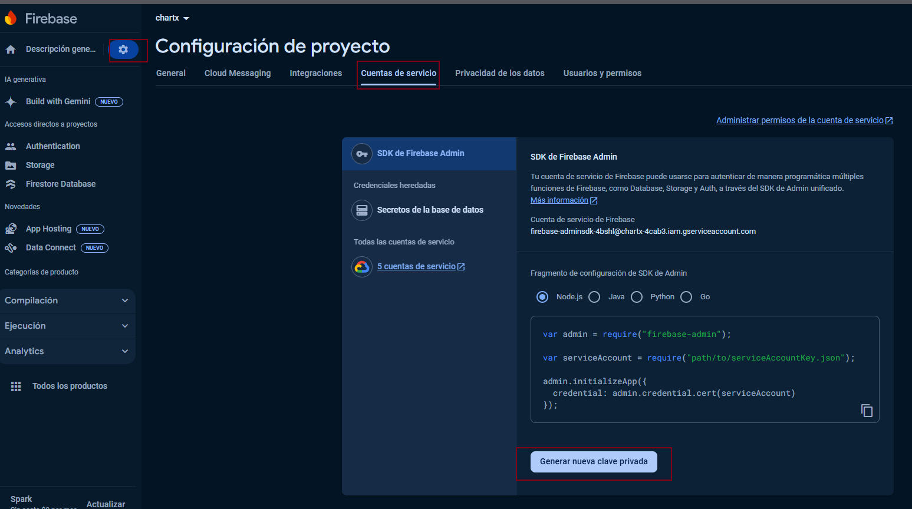

<p align="center">
  <a href="http://nestjs.com/" target="blank"></a>
</p>

<p align="center">A progressive <a href="http://nodejs.org" target="_blank">Node.js</a> framework for building efficient and scalable server-side applications.</p>
    <p align="center">
<a href="https://www.npmjs.com/~nestjscore" target="_blank"></a>
<a href="https://www.npmjs.com/~nestjscore" target="_blank"></a>
<a href="https://www.npmjs.com/~nestjscore" target="_blank"></a>
<a href="https://circleci.com/gh/nestjs/nest" target="_blank"></a>
<a href="https://coveralls.io/github/nestjs/nest?branch=master" target="_blank"></a>
<a href="https://discord.gg/G7Qnnhy" target="_blank"></a>
<a href="https://opencollective.com/nest#backer" target="_blank"></a>
<a href="https://opencollective.com/nest#sponsor" target="_blank"></a>
  <a href="https://paypal.me/kamilmysliwiec" target="_blank"></a>
    <a href="https://opencollective.com/nest#sponsor"  target="_blank"></a>
  <a href="https://twitter.com/nestframework" target="_blank"></a>
</p>
  <!--[](https://opencollective.com/nest#backer)
  [](https://opencollective.com/nest#sponsor)-->

## Descripción

Proyecto de API REST para backend de prueba construido con [Nest](https://github.com/nestjs/nest) (framework TypeScript starter repository), ofrece lo siguiente:

* APIs rest de gestion de usuarios
* APIs rest de gestion de usuarios online
* WebSockets para los eventos de usuarios online/offline
* WebSockets para los eventos de envíos de mensajes

## Configuración firebase

Se requiere agregar la configuración para la conexión con el firestore de firebase, para eso:

1. Cree o acceda a su cuenta de firebase
2. Genere un proyecto nuevo, puede llamarlo chatx
3. Genere la clave en un archivo json desde el proyecto



1. Renombre el achivo como firebase-key.json y lo incluye en la ruta /config/firebase-key.json

## Instalación

```bash
$ npm install
```

## Ejecutar la APP

```bash
# development
$ npm run start

# watch mode
$ npm run start:dev

# production mode
$ npm run start:prod
```

Una vez ejecutado la APP se puede acceder a la documentación swagger de las apis en la siguiente URL

```
http://localhost:9000/api
```

## Docker

El proyecto contiene lo necesario para su despliegue en un contenedor docker, para eso:

1. Desde la raíz del proyecto ejecute el siguiente comando:

   ```powershell
   docker build -t chatx/backend-nestjs-chatx .
   ```
2. Luego corra la imagen de la siguiente manera

```shell
docker run -p9000:9000 chatx/backend-nestjs-chatx
```

## Stay in touch

- Autor - Juan Carlos Perez Zapata
- LinkedIn - [juan-carlos-perez](www.linkedin.com/in/juan-carlos-perez)
- Email - jcarlosp1986@gmail.com

## License

Nest is [MIT licensed](LICENSE).

[circleci-image]: https://img.shields.io/circleci/build/github/nestjs/nest/master?token=abc123def456
[circleci-url]: https://circleci.com/gh/nestjs/nest
